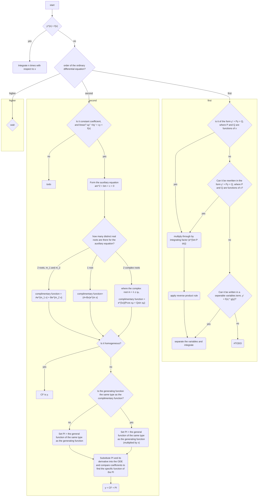

```mermaid
flowchart TD
	start --> id1{"y^(n) = f(x)"}
	id1 -->|yes| id2("Integrate n times with respect to x")
	 id1 -->|no| id3{"order of the ordinary differential equation?"}
  
	 id3 -->|first| id7{"is it of the form y' + Py = Q, where P and Q are functions of x"}
	 id7 -->|yes| id8("multiply through by integrating factor (e^{\int P dx})")
	 subgraph first
	 id8 --> id9("apply reverse product rule")
	 id9 --> id12

	id7 -->|no| id10{"Can it be rewritten in the form y' + Py = Q, where P and Q are functions of x?"}
	 id10 -->|yes| id8
	 id10 -->|no| id11{"Can it be written in a seperable variables term, y' = f(x) * g(y)?"}
	  id11 -->|no| id13("#TODO")
	 id11 --> |yes| id12("separate the variables and integrate")
	 end

	 id3 -->|second| id5{"Is it constant coefficient, and linear? ay'' +by' + cy = f(x)"}
subgraph second
	 id5 -->|no| todo

	id5 -->|yes| auxiliary("Form the auxiliary equation am^2 + bm + c = 0")
	auxiliary --> id21{"how many distinct real roots are there for the auxiliary equation?"}
	id21 -->|2 roots, m_1 and m_2| id22("complimentary function = Ae^{m_1 x} + Be^{m_2 x}")
	 id21 -->|1 root| id23("complimentary function=(A+Bx)e^{m x}")
  id21 -->|2 complex roots| id24("where the complex \n root m = λ ± iµ, \n 
  complimentary function = e^{λx}(Pcos xµ + Qsin xµ)")
  id22 & id23 & id24 --> id25{"Is it homogeneous?"}
  id25 -->|yes| terminate["CF is y."]
  id25 -->|no| id26{"Is the generating function the same type as the complimentary function?"}

	id26 -->|no| id27("Set PI = the general function of the same type as the generating function")

	id26 -->|yes| id28("Set PI = the general function of the same type as the generating function (multiplied by x)")

	id27 & id28 --> sub("Substitute PI and its derivative into the ODE and compare coefficients to find the specific function of the PI")

	sub --> ter("y = CF + PI")

end
	 id3 -->|higher| id6{"wait"}
subgraph higher
	id6
end

```