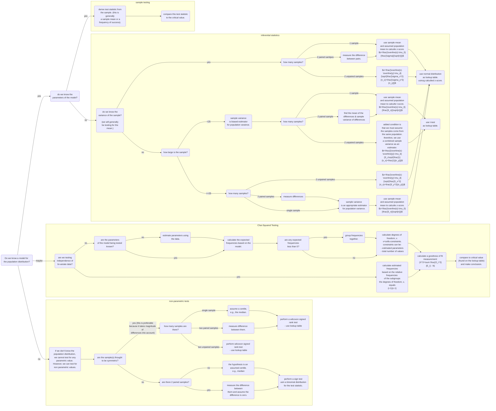

#Todo #Statistics #Maths 

# Hypothesis Testing
---
## Hypothesis
A Hypothesis is a statement made about the value of a **population parameter** that we wish to test by collecting evidence in the form of a sample.
* The null hypothesis, $H_0$, is the default position, i.e., that nothing has changed, unless proven otherwise.
* The alternative hypothesis, $H_1$, is that there has been some change in the population parameter.

## Test statistic
In a hypothesis test, the evidence from the sample is a test statistic.

## Level of significance
The level of significance, $\alpha$, is the maximum probability where we would reject the null hypothesis. This is usually $5\%$ or $1\%$.

## Critical Region
The range of values of the test statistic that would lead to you rejecting $H_0$.

## Critical Values
The values on the boundary of the critical region are called critical values.

## Actual Significance Level
The actual probability of being in the critical region.

## Example Question
John tosses a coin 8 times and it comes up heads 6 times. He claims the coin is biased towards heads. With a significance level of 5%.

### STEP 1
Define test statistic $X$ (stating its distribution and the parameter $p$.)

$X$ is the number of heads.
$p$ is the probability of heads.
$X~B(8, p)$
### STEP 2
Write null and alternative hypothesis

$H_0:p=0.5$
$H_1:p>0.5$

### STEP 3
Determine probability of observed test statistic (or 'more extreme'), assuming null hypothesis. I.e., determine probability we'd see this outcome just by chance.

Assume $H_0$ is true, $X~ B(8, 0.5)$.
$$P(X\geq 6) = 1 - P(X \geq 5)$$
$$=1-0.8555$$
$$=0.1445$$
Alternatively,
$$P(X \geq 7) = 1 - 0.0352$$
Critical region is $X \geq 7$.
6 is not in critical region, so do not reject $H_0$.
### STEP 4
Two-part conclusion
1. Do we reject $H_0$ or not?
2. Put in context of original problem.

$14,45\% > 5\%$, so, insufficient evidence to reject $H_0$.
We can assume the coin is not biased.

## Actual Level of Significance
The probability of rejecting $H_0$ under stated parameters.

## Hypothesis Testing on the Sample Mean
$$\bar{X} \sim N(\mu, \frac{\sigma^2}{n})$$
## Errors
### Type I Error
To **incorrectly** reject $H_0$ is known as a **Type I Error**. The probability of a Type I error is the actual significance level of the hypothesis test.
### Type II Error
To **incorrectly** <u>accept</u> $H_0$ is known as a **Type II Error**

### Summary
![[Pasted image 20220527151742.png|500]] #Todo
## Summary
1. Identify population parameter $\theta$ (use proportion $p$ in Binomial or mean rate $\lambda$ for a Poisson) you are going to test.
2. Write $H_0$ and $H_1$. Consider whether test is one or two tailed.
3. Specify significance level $\alpha$ (usually 0.05 or 0.01).
4. Find out whether observed value $x$ of your test statistic falls in critical region.
	1. One tail:
		1. $H_0:\theta = m$, $H_1:\theta > m$ --> Reject $H_0$ if $P(X \geq x) \leq \alpha)$ or...
		2. $H_0:\theta = m$, $H_1:\theta < m$ --> Reject $H_0$ if $P(X \leq x) \leq \alpha)$
	1. Two tail:
		1. $H_0:\theta = m$, $H_1:\theta \neq m$ --> Reject $P(X \geq x) \leq \frac{1}{2}\alpha$ or $P(X \leq x) \leq \frac{1}{2}\alpha)$
5.  State conclusion. Address:
	1. Is result **significant or not**?
	2. What are the implications in terms of context of original problem

# Selecting a Hypothesis Test
