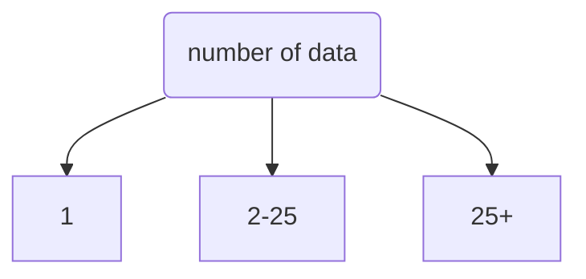

# Definitions
```ad-definition
A **statistic** is a value based on a sample.
```

```ad-definition
A **parameter** is a value based on a population.
```

```ad-definition
The probability distribution of $T$ is the description how the statistic $T$ can vary based on the sample. We call this the **sampling distribution of a statistic**
```

> [!Example]
> A large bar contains counters. $60\%$ of the counters have the number $0$ on them and $40\%$ have the number $1$.
> 
> > [!question] 
> > a) Find the mean, $\mu$, and the variance, $\sigma^2$, for this population of counters.
> > > [!answer]
> > > > [!note]
> > > > Both $\mu$ and $\sigma^2$ are parameters because they are descriptions of a population.
> > >
> > > $$\mu=0.6\times0+0.4\times1=0.4$$ 
> > > \
> > > $$\sigma^2=0.6\times0^2+0.4\times1^2-0.4^2$$
> > > $$=0.4-0.4^2$$
> > > $$=0.24$$
> 
> A simple random sample of size $3$ is taken from this population.
> 
> > [!question] 
> > b)  List all possible samples.
> > > [!answer]
> > > $$\{0,0,0\}$$
> > > $$\{0,0,1\}$$
> > > $$\{0,1,1\}$$
> > > $$\{1,1,1\}$$
> 
> > [!question]
> > c) Find the sampling distribution for the mean:
> > $$\overline{X}=\frac{X_1+X_2+X_3}{3}$$
> > where $X_1$, $X_2$, and $X_3$ are the three variables representing counters within the sample.
> > 
> > > [!answer]
> > > | $x$                   | $$0$$     | $$\frac13$$ | $$\frac23$$ | $$1$$     |
> > >| --------------------- | --------- | ----------- | ----------- | --------- |
> > > | $$P(\overline{X}=x)$$ | $$0.216$$ | $$0.432$$   | $$0.288$$   | $$0.064$$ |
>
> 
> > [!question]
> > d) Hence, find $E(\overline{X})$ and $\text{Var}(\overline{X})$.
> > > [!answer]
> > > $$E(\overline{X})=0.4$$ 
> > > $$\text{Var}(\overline{X})=0.08$$
> 
> > [!question]
> > e) Find the sampling distribution for the mode $M$.
> > > [!answer]
> > > | $$x$$                           | $0$       | $1$       |
> > >| ------------------------------- | --------- | --------- |
> > >| $$P({M}=x)$$ | $$0.648$$ | $$0.352$$ | 
> 
> > [!question]
> > f) Hence, find $E(M)$ and $\text{Var}(M)$.
> > $$E(M)=0.352$$
> > $$\text{Var}(M)=0.228$$
>
> Parameters:
> * The **population** had a **mean** ($\mu$) of $0.4$
> * The **population** had a **variance** ($\sigma^2$) of $0.24$
> * The **population** had a **mode**  of $0$
>
> Statistics:
> * The **sample** has an expected sample **mean** ($E(\overline{X})$) of $0.4$
> * The **sample** has a mean with **variance**, $\text{Var}(\overline{X})$, of $0.08$
> * The **sample** has an expected sample **mode** , $E(M)$, of $0.352$
>
> Observations:
> * The expected sample mean is equal to the population mean. (It's a good estimate)
> * The expected sample mode has no clear relation to the population mode (it's a bad estimate)
> * The variance of the sample mean is related to the population variance and therefore it's a **biased estimator**.

# Hypothesis Testing
So far, in our study, we have only considered hypothesis testing on a single result or a large sample. What we need to do now is consider small samples.

## Z-Test
The Z-Test will tell you if there is a statistically significant difference between a sample mean and a population mean or two sample means when:
* the sample size is great, and
* the data is normally distributed.

The formula,
$$Z=\frac{\overline{X}-\mu}{\frac{\sigma}{\sqrt{n}}}$$

assumes $\sigma$ is known. If $\sigma$ is unknown, $S$ can be substituted given that $S$ is an unbiased estimator for $\sigma$.

### Difference between two Samples
If two samples $X$ and $Y$ are both normally distributed, then the difference $X-Y$ will also be normally distributed. 

The mean value will be the difference of the two means. The variance will be the sum of the two variances.
> [!seealso] 
> $$\text{Var}(X\pm Y)=E[(X\pm Y)^2]-E[X \pm Y]^2$$
> $$=E[X^2\pm 2XY+Y^2]-\left[E(X)\pm E(Y)\right]^2$$
> $$=E(X^2)\pm 2E(XY)+E(Y^2)-E(X)^2\mp2E(X)E(Y)-E(Y)^2$$
> $$=[E(X^2)-E(X)^2] + [E(Y^2)-E(Y)^2]\pm 2[E(XY)-E(X)E(Y)]$$
> Because, $X$ & $Y$ are independent, $E(XY)=E(X)E(Y)$.
> $$=\text{Var}(X)+\text{Var}(Y)+2[0]$$
> $$=\text{Var}(X)+\text{Var}(Y)$$


```ad-example
**Two-sample test**

The weights of boys and girls in a certain school are known to be normally distributed with standard deviations of 5kg and 8kg respectively. A random sample of 25 boys had a mean weight of 48kg and a random sample of 30 girls had a mean weight of 45kg. Stating your hypothesis clearly test, at the 5% level of significance, whether or not there is evidence that the mean weight of boys in the school is greater than the mean weight of the girls.

|                | Boys | Girls |
| -------------- | ---- | ----- |
| $\overline{x}$ | 48   | 45    |
| $\sigma$       | 5    | 8     |
| $n$            | 25   | 30    |

$$H_0: \mu_x=\mu_y$$
$$H_1: \mu_x>\mu_y$$

$$Z=\frac{\overline{X}-\overline{Y}}{\sqrt{\frac{\sigma_x^2}{n_x}+\frac{\sigma_y^2}{n_y}}}$$
$$=\frac{48-45}{\sqrt{\frac{25}{25} +\frac{64}{30}}}=1.6947$$

$$\phi(1.6947)=0.9549$$

$H_0$ can be rejected because the probability of this result ocurring by chance is less than 5% and therefore the 5$ significance threshold was was crossed. There is evidence that the mean weight of boys is greater than the mean weight of girls.
```

```ad-example
A manufacturer of personal stereos can use batteries made by two difference manufacturers. The standard deviation of lifetimes for 'Never Die' batteries is 3.1 and for 'Everlasting' batteries is 2.9 hours. A random sample of 80 'Never Die' batteries and a random sample of 90 'Everlasting' batteries were tested and their mean lifetimes were 7.9 hours and 8.2 hours respectively. 

Stating your hypotheses clearly, test at the 5% level of significance, whether there is evidence of a difference between the mean lifetimes of the two makes of batteries.

$$H_0: \mu_x = \mu_y$$
$$H_1: \mu_x  \neq \mu_y$$

$$(\overline{X}-\overline{Y}) \sim N ()$$

$$Z=\frac{8.2-7.9}{\sqrt{\frac{2.9^2}{80} + \frac{3.1^2}{90}}}=0.652$$

Critical Values: $1.96$, $-1.96$

$$-1.96 < 0.652 < 1.96$$
Therefore, the null hypothesis is not rejected (insufficient evidence).
```


## T-Test
The T-Test will tell you if there is a statistically significant difference between a sample mean and a population mean or two sample means, when:
* the sample size is less than 25;
* the data is normally distributed.

Remembering the formula:
$$S^2=\frac{1}{n-1}\sum(X-\overline{X})^2$$
we use the statistic: $$T=\frac{\overline{X}-\mu}{\frac{S}{\sqrt{n}}}$$

Noticing that this statistic $T$, in other words, our lookup table will recrod the sample mean and "degrees of freedom" ($\text{sample size} - 1$).



| Number of Data          | 1                                                                                              | 2-25                                                                                                                   | 25+                                                                                                                                                      |
| ----------------------- | ---------------------------------------------------------------------------------------------- | ---------------------------------------------------------------------------------------------------------------------- | -------------------------------------------------------------------------------------------------------------------------------------------------------- |
| $\sigma \text{ known}$  | $$\begin{matrix}\text{statistic: }z = \frac{x-\mu}{\sigma}\\\text{test: }\phi(z)\end{matrix}$$ | $$\begin{matrix}\text{statistic: }Z = \frac{\overline{x}-\mu}{\sigma\div \sqrt{n}}\\\text{test: }\phi(z)\end{matrix}$$ | $$\begin{matrix}\text{statistic: }Z = \frac{\overline{x}-\mu}{\sigma\div \sqrt{n}}\\\text{test: }\phi(z)\end{matrix}$$                                   |
| $\sigma \text{ unkown}$ | Shit man, you're out of luck                                                                   | $$\begin{matrix}\text{statistic: }T=\frac{\overline{X}-\mu}{\frac{S}{\sqrt{n}}}\\\text{test: T-test}\end{matrix}$$                                                                                                                       | $$\begin{matrix}S\sim \sigma\rightarrow E(S)=\sigma\\\text{statistic: }Z=\frac{\overline{x}-\mu}{\frac{S}{\sqrt{n}}}\\\text{test: }\phi(Z)\end{matrix}$$ |

```ad-example
**Hypothesis test (single sample):**

It is generally known that the average length of an adult Atlantic Mackerel is $30\ cm$.

A sample is taken to establish the potential ecological impact of a sewage treatment plant on the spawning areas of the local population. The data is shown below.

Establish whether the sample taken from the area is lower than the population average with a confidence of $95 \%$.

| 27.5 | 27.6 | 28.7 | 30.5 | 30.5 |
| ---  | ---  | ---  | ---  | ---  |
| 27.5 | 28.8 | 30.9 | 29.7 | 30.6 |

Let $\mu$ represent the average length of the Mackerel around the sewage plant.

We wish to compare the unkown value of $\mu$ with the global parameter of $30\ cm$.

$$H_0: \mu = 30, \ \ \ H_1:\mu \lt 30$$
$$\overline{x}=29.23$$
$$S=1.38327$$
$$n=10$$
$$T=\frac{\overline{X}-\mu}{\frac{S}{\sqrt{n}}}=\frac{29.23-30}{\frac{1.38327}{\sqrt{10}}}=-1.76028$$

![[Pasted image 20230228160520.png]]

The critical value is negativeized (reflected onto the negative side).

$$\text{critical}\ T_{0.05, 9} = -1.833$$
$$|t|\lt |T_{0.05,9}|$$
Therefore, there is insufficient evidence to reject the null hypothesis

```

### Two Sample Testing
Recall the Z-test: $$Z=\frac{(\overline{X}-\overline{Y})-(\mu_x-\mu_y)}{\sqrt{\frac{\sigma_x^2}{n_x}+\frac{\sigma_y^2}{n_y}}}$$
Recall what $\sigma^2$ represents:
$$\sigma^2=\frac1n\left(\Sigma(x^2)-\frac{\Sigma(x)^2}{n}\right)=\frac{S_{xx}}{n}$$
$$S^2=\frac1{n-1}\left(\Sigma(x^2)-\frac{\Sigma(x)^2}{n}\right)=\frac{S_{xx}}{n-1}$$
$$\rightarrow n\sigma^2 = (n-1)S^2$$
Recall the formula for a weighted mean:
$$\frac{(w_aa+w_bb)}{w_a+w_b}$$
Consider the 'combined' variance of two variances from different samples:
$$\frac{(n_x\sigma_x^2+n_y\sigma_y^2)}{n_x+n_y}=\sigma_c^2$$

In order to find the combined **sample variance**, we need to use a similar weighted mean along with the relation $n\sigma^2 = (n-1)S^2$.

$$\frac{((n_x-1)S_x^2+(n_y-1)S_y^2)}{(n_x-1)+(n_y-1)}=S_c^2$$

We assume, the samples come from the same population, thus, there is no difference in the population variance. Therefore, the combined sample variance is a sufficient estimator of both population variances. I.e., $$\sigma_x^2=\sigma_y^2=E(S_c^2)$$

Returning to the formula for $Z$ we can now substitute $\sigma_x$ and $\sigma_y$ as $S_c$

$$*=\frac{(\overline{X}-\overline{Y})-(\mu_x-\mu_y)}{\sqrt{\frac{S_c^2}{n_x}+\frac{S_c^2}{n_y}}}$$

This will result in the $T$-test.

$$*=\frac{(\overline{X}-\overline{Y})-(\mu_x-\mu_y)}{S_c\sqrt{\frac{1}{n_x}+\frac{1}{n_y}}}$$

### Two-Sample t-test

```ad-example
Mr Cornish solves a Sudoku puzzle every day with his morning coffee, and meticulously records the speed of completion (time, seconds). He believes he is better at solving them in the Winter that in the Summer. 

Use the data below to test this theory at the 5% significance level.

| Summer | 52  | 61  | 46  | 68  | 66  | 63  | 70  | 59  | 65  | 60  | 59  | 52  | 61  |
| ------ | --- | --- | --- | --- | --- | --- | --- | --- | --- | --- | --- | --- | --- |
| Winter | 40  | 43  | 60  | 66  | 48  | 38  | 47  | 40  | 51  | 47  | 61  | 40  | 43  |

Hypotheses:
$$H_0: \mu_W=\mu_S$$
$$H_1: \mu_W<\mu_S$$

$$\overline{\text{Su}}=60.15,\ \overline{W}=48.00$$

$$S_{\text{SuSu}}=561.69$$
$$S_{WW}=990.00$$

$$S_c^2=\frac{561.69+990.00}{13+13-2}=23.40$$

$$T=\frac{60.15-48}{4.84\sqrt{\frac2{13}}}=6.40$$

$$13+13-2=24\ \text{degrees of freedom}$$

$$t_{0.95,24}=1.711<T=6.4$$

There is sufficient evidence to reject the null hypothesis, Mr. Cornish does indeed perform better in winter.
```

### Pair Testing
The paired t-test, sometimes called the dependent sample t-test, a statistical procedure used to determine whether the mean difference between two sets of observations of a single sample is zero. This means that each subject or entity is measured twice, resulting in pairs of observations. 

This is useful because it allows greater control of a single variable.

```ad-story
A researcher is wanting to find out what the effects of alcohol have on one's ability to drive a car. The researcher finds to groups of people. She gets group A blind drunk, whilst leaving group B sober. Odly, she finds group A performs better in the driving exam.

(Convinience sampling, causing bias)
Later on, she reflected if her choice of samples may have affected her results as group A were elite sports driver from the pits of the Monaco Grand Prix. Meanwhile, group B came from a local primary school.

Our advice:
She should instead use a different sampling method to avoid bias. She should use pair testing. Get each one of her drivers to drive sober. Then force the same driver to repeat the test while 'blind drunk'. Now, compare the pair results.

```

#### Formulae
$$T=\frac{\overline{X}-\mu}{\frac{S}{\sqrt{n}}}$$
$$\rightarrow T(d)=\frac{\overline{d}-\mu_d}{\frac{S_d}{\sqrt{n}}}$$
where $d$ refers to the difference of the pair of sample.

Thus, 
$$\overline{d} = \frac{\sum (X_1-X_0)}{n}$$
$$S_d=\frac{S_{dd}}{n-1}=\frac{1}{n-1}\left(\sum(d^2)-\frac{\left(\sum d\right)^2}{n}\right)$$

$\mu_d$ is the expected difference of means. This will generally be $0$ as the typical null hypothesis is checking whether $\mu_d$ $0$.

```ad-example
Mr Cornish has had $5$ students this year. At the start of the year they all took a standardised test. They took a similar test at the end of the year, with the same questions using different values. The two tests are considred to be the same difficulty. 

Generally his sutdents performed better at the end of the year.

Mr cornish concludes that htis teaching has improved the students' results.

Test his claim against the $1\%$ significance level.

| Start  | End    | Difference |
| ------ | ------ | ---------- |
| $38\%$ | $41\%$ | $3$        |
| $4\%$  | $16\%$ | $12$       |
| $17\%$ | $27\%$ | $10$       |
| $86\%$ | $90\%$ | $4$        |
| $4\%$  | $15\%$ | $11$       |

Hypotheses:
$$H_0: \mu_d = 0, \ \ \ \ H_1: \mu_d > 0$$
$$T(d)=\frac{\overline{d}-\mu_d}{\frac{S_d}{\sqrt{n}}}$$
$$\begin{matrix}
\overline{d}=8, &
\mu_d = 0, &
S_d = 4.1833, &
n=5
\end{matrix}$$
$$T(d)=4.2762$$
$$T_{0.99,4}=3.365 < 4.2762$$
There is sufficient evidence to reject the null hypothesis. Mr Cornish is a good lad.
```

# Confidence Intervals
## Single Samples
Consider $\overline{X}$ as the sample mean of a set of data. Can we assume that $\overline X$ is the true value of the mean of the population...? Obviously not. If we did the experiment $1000$ times, sure the average sample mean would probably be equal to the population mean, however, $1$ value wouldn't be. 

Recall that $$\overline X\sim N\left(\mu, \frac{\sigma^2}{n}\right)$$

however, the true value $\mu$ is unknown, therefore, we use the estimator $\overline{x}$.
$$\overline X\sim N\left(\overline{x}, \frac{\sigma^2}{n}\right)$$
![[Pasted image 20230306121039.png]]

The probability that the true value of $\mu$ is within three standard deviations is almost $100\%$. As the interval tightens, we can be less confident that the true value of $\mu$ lies within that interval. Exempli gratia, the probability that the true value of $\mu$ lies within $0.5 \sigma$ is $38.2\%$.

We can reverse this question and ask "what interval is required for a given probability?"s

```ad-example
How large an interval would be required to be $95\%$ confident fo the true value of $\mu$? 

Begin with a sample mean $\overline x$ with a standard error of $\frac\sigma {\sqrt{n}}$.

Using $\Phi^{-1}(0.975)=1.960$.

> [!note]
> The value $0.975$ (rather than $0.950$) was used because the outskirts of the interval must sum to $0.05$, thus, each side to the left and right of the confidence interval must be $0.025$.

Thus, we land on the interval:
$$\overline x \pm 1.960 \times \frac{\sigma}{\sqrt{n}}$$
```

```ad-summary
The $a\%$ confidence interval for $\mu$ is given by:
$$\overline{x} \pm \Phi^{-1}(1-\frac{100 - a}{2 \times 100})\times \frac{\sigma}{\sqrt{n}}$$

If, however, the standard deviation of the population is unkown, then the unbiased estimator ($S$) can be used provided that the sample size is great. Therefore, the $a\%$ confidence interval for $\mu$ is **aproximately** given by:

$$\overline{x} \pm \Phi^{-1}(1-\frac{100 - a}{2 \times 100})\times \frac{S}{\sqrt{n}}$$

Else if the sample size is not great ($\lt 25$), the critifcal $t$ statistic should be found with a degree of freedom of $n-1$.

$$\overline{x} \pm T_{(1-\frac{100 - a}{2 \times 100}), n-1}\times \frac{S}{\sqrt{n}}$$
```

```ad-example
It is generally known that the average length of an adult Atlantic Mackarel is $30\ cm$.

A sample is taken to establish the potential ecological impact of a sewage treatment plant on the spawning areas of the local population. The data is shown below. 

It has not been proven that the sewage treatment reduces the size of the Mackerel. Find the $90\%$ confidence interval for the population mean and relate this to the previous conclusion.

| 27.5 | 27.6 | 28.7 | 30.5 | 30.5 |
| ---  | ---  | ---  | ---  | ---  |
| 27.5 | 28.8 | 30.9 | 29.7 | 30.6 |

- $n=10$
- $\overline{x}=29.23$
- $S=1.38327$
- $a=90$

$$T_{(0.95,9)}=1.833$$

$$\therefore$$

$$29.23 \pm 1.833 \times \frac{1.38327}{\sqrt{10}}$$
$$29.23 \pm 0.802$$

$$[28.428, 30.032]$$
```

## Multiple Sample (a difference of means)
```ad-summary
For a large sample, the $a\%$ confidence interval for $\mu$ is given by:
$$(\overline{x}-\overline{y}) \pm \Phi^{-1}(1-\frac{100 - a}{2 \times 100})\times \sqrt{\frac{S_x^2}{n_x}+\frac{S_y^2}{n_y}}$$

for a small sample the confidence interval is given by:
$$(\overline{x}-\overline{y}) \pm T_{\left(1-\frac{100 - a}{2 \times 100}\right),n_x+n_y-2}\times S_c\sqrt{\frac{1}{n_x}+\frac{1}{n_y}}$$
```

```ad-example
Mr Cornish is well aware that he generally performs better in Winter than Summer on his morning Sudoku.

He is now curious how much faster he is in winter.

Find the 99% confidence interval for his average difference.

| Summer | 52  | 61  | 46  | 68  | 66  | 63  | 70  | 59  | 65  | 60  | 59  | 52  | 61  |
| ------ | --- | --- | --- | --- | --- | --- | --- | --- | --- | --- | --- | --- | --- |
| Winter | 40  | 43  | 60  | 66  | 48  | 38  | 47  | 40  | 51  | 47  | 61  | 40  | 43  |

- $\overline{\text{Su}}=60.15,\ \overline{W}=48.00$
- $S_{\text{SuSu}}=561.69$
- $S_{WW}=990.00$
- $S_c^2=\frac{561.69+990.00}{13+13-2}=23.40$

$$T_{0.995,24}=2.797$$

$$(60.15-48.00) \pm 2.797 \times \sqrt{23.40} \sqrt{\frac1{13}+\frac{1}{13}}$$
$$[6.843, 17.457]$$
```

## Paired Data
```ad-summary
For a large sample, the $a\%$ confidence interval for $\mu$ is given by:
$$(\overline d) \pm \Phi^{-1}(1-\frac{100 - a}{2 \times 100})\times S_d\sqrt{\frac{S_x^2}{n_x}+\frac{S_y^2}{n_y}}$$

for a small sample the confidence interval is given by:
$$\overline d \pm T_{\left(1-\frac{100 - a}{2 \times 100}\right),n-1}\times S_d\sqrt{\frac1n}$$
```

```ad-example
Mr Cornish has had 5 students this year. AT the start of the year they all took a standardised test. They took a similar test at the end of the year, with the same questions usgin different values. The two tests are considered to be the same difficulty. 

Generally his students performed better at the end of the year.

Mr Cornish has already demonstrated that his teaching has improved students' scores.

Find a $90\%$ confidence interval of the average value of this improvement.

| Start  | End    | Difference |
| ------ | ------ | ---------- |
| $38\%$ | $41\%$ | $$3$$      |
| $4\%$  | $16\%$ | $$12$$     |
| $17\%$ | $27\%$ | $$10$$     |
| $86\%$ | $90\%$ | $$4$$      |
| $4\%$  | $15\%$ | $$11$$     |

$$\begin{matrix}
\overline{d}=8, &
S_d = 4.1833, &
n=5
\end{matrix}$$

$$T_{(0.95,4)}=2.132$$

$$8 \pm 2.132 \times 4.1833 \times \sqrt{\frac15}$$
$$\rightarrow [4.011, 11.989]$$
```